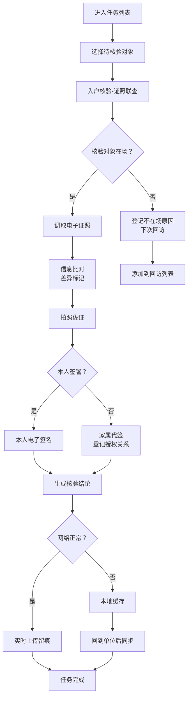

## 1. 产品概述

面向社区网格员、民政协理员和基层上门服务人员的平板核验终端，专门用于低保、救助、老年补贴、残疾人服务等入户场景下的电子证照现场核验与用证留痕。产品通过"现场核验有依据、上门用证留得住"的设计理念，解决基层入户核验效率低、留痕难、取证不规范等问题。

- **核心价值**：提升入户核验效率，规范用证流程，确保证据链完整可追溯
- **目标用户**：社区网格员、民政协理员、基层上门服务人员
- **使用场景**：楼道、村居、养老点等户外/半户外环境，单手操作

## 2. 核心功能

### 2.1 用户角色

| 角色 | 登录方式 | 核心权限 |
|------|----------|----------|
| 网格员/协理员 | 工号+密码/人脸识别 | 任务查看、入户核验、授权签认、异常上报、回访记录 |
| 街道管理员 | 管理员账号 | 任务分配、数据统计、异常线索审核 |

### 2.2 功能模块（5个核心窗口）

1. **任务列表**：当日待核验任务、任务状态、完成率统计、离线缓存管理
2. **入户核验**：证照联查、信息比对、拍照佐证、差异标记、核验结论
3. **授权签认**：电子签名、家属代签授权、拒绝授权原因登记
4. **异常上报**：疑似冒领线索、异常情况描述、证据上传、线索跟踪
5. **回访记录**：回访任务、回访内容、回访结果、历史记录查询

### 2.3 页面详情

| 页面名称 | 模块名称 | 功能描述 |
|----------|----------|----------|
| 任务列表 | 今日任务 | 按优先级展示当日待核验对象，显示姓名、地址、核验类型、证照范围 |
| 任务列表 | 完成统计 | 按街道/社区汇总任务完成率，已完成/进行中/待核验数量 |
| 任务列表 | 离线管理 | 查看缓存数据、一键同步、网络状态显示 |
| 入户核验 | 证照联查 | 身份证读取+电子证照调取，展示允许调用的证照范围 |
| 入户核验 | 信息比对 | 证照信息与实际居住情况对比，差异项标记 |
| 入户核验 | 拍照佐证 | 现场拍照（门牌、人像、居住环境），照片标注用途 |
| 入户核验 | 核验结论 | 核验通过/待复核/不通过选项，自动生成核验结论 |
| 授权签认 | 电子签名 | 大屏手写签名区域，支持老人及家属签名 |
| 授权签认 | 代签授权 | 家属代签时登记代签人关系、身份证号、授权原因 |
| 授权签认 | 拒绝登记 | 记录拒绝授权原因，可选预设+自定义描述 |
| 异常上报 | 线索上报 | 疑似冒领套领线索填报，包含人员信息、异常描述 |
| 异常上报 | 证据上传 | 相关证照照片、现场照片、谈话录音（可选） |
| 异常上报 | 线索跟踪 | 已上报线索列表，查看处理状态和反馈 |
| 回访记录 | 回访任务 | 待回访对象列表，显示上次核验结果 |
| 回访记录 | 回访登记 | 回访情况记录，整改情况确认 |
| 回访记录 | 历史查询 | 按人员查询历史核验和回访记录 |

## 3. 核心流程

### 主要核验流程
网格员领取当日任务 → 入户找到核验对象 → 确认身份并说明来意 → 调取电子证照 → 核对信息并拍照佐证 → 差异标记（如有）→ 本人或家属授权签名 → 生成核验结论 → 数据同步（在线实时/离线缓存）。

### 异常上报流程
核验中发现异常 → 标记异常类型 → 收集证据材料 → 填写异常描述 → 提交线索 → 街道审核处理 → 结果反馈。

## 4. 用户界面设计

### 4.1 设计风格
- **设计调性**：朴素耐用、功能优先，字大按钮大，适合中老年基层人员使用
- **主色调**：藏蓝色 `#1E3A5F`（政府服务稳重感），搭配白色 `#FFFFFF` 背景
- **辅助色**：
  - 核验通过：绿色 `#22C55E`
  - 待复核：橙色 `#F97316`
  - 异常/不通过：红色 `#EF4444`
  - 操作按钮：蓝色 `#2563EB`
- **按钮样式**：大尺寸圆角矩形（圆角12px），高对比度文字，最小点击区域60×60px，适合单手触控
- **字体**：系统无衬线字体（微软雅黑/PingFang SC），正文最小18px，标题24-32px，加粗显示
- **布局风格**：卡片式布局，大留白，分区明确，单屏信息量控制在3-5个操作项
- **图标风格**：粗线条实心图标，表意明确，避免抽象符号，尺寸不小于32px
- **整体感受**：像"政务服务终端"，稳定可靠，操作步骤清晰，减少思考成本

### 4.2 页面设计概述

| 页面名称 | 模块名称 | UI 元素 |
|----------|----------|---------|
| 任务列表 | 顶部状态栏 | 日期、网络状态、登录人员信息、同步按钮 |
| 任务列表 | 统计卡片 | 今日任务数、已完成、待核验三个大数字卡片，完成率环形进度 |
| 任务列表 | 任务列表 | 每张任务卡片：姓名、地址标签、核验类型图标、优先级标记、操作按钮 |
| 任务列表 | 底部导航 | 5个窗口切换按钮，大图标+文字 |
| 入户核验 | 人员信息卡 | 大字体展示姓名、身份证号、住址，头像区域 |
| 入户核验 | 证照列表 | 可调用证照卡片，带"已授权"/"待调取"状态标识 |
| 入户核验 | 比对区域 | 左右两栏对比：证照信息 vs 实际情况，差异项红色高亮 |
| 入户核验 | 拍照区 | 大拍照按钮，已拍照片缩略图带删除功能 |
| 入户核验 | 核验结论 | 三个大按钮：核验通过、待复核、不通过 |
| 授权签认 | 签名区域 | 大面积手写板，清除/确认按钮分置两侧 |
| 授权签认 | 代签表单 | 代签人姓名、关系、身份证号三个大输入框 |
| 授权签认 | 拒绝原因 | 预设原因复选框（行动不便、意识不清、拒绝配合、其他），补充说明输入框 |
| 异常上报 | 线索表单 | 异常类型下拉、涉事人员、异常描述大文本框 |
| 异常上报 | 证据区 | 照片/视频上传入口，已上传文件列表 |
| 回访记录 | 回访卡片 | 历史核验记录时间线，每次记录展开查看详情 |

### 4.3 响应式设计
- **平板优先**：主要适配10-12寸平板（横屏1280×800、1920×1200）
- **触控优化**：所有可点击元素≥60×60px，间距≥16px，避免误触
- **单手操作**：核心操作按钮集中在屏幕下半区右侧（右手持机场景）
- **大字体**：最小可点击文字16px，正文字18px，标题24px+，重要信息32px

### 4.4 无障碍与易用性
- **高对比度**：文字与背景对比度≥4.5:1，符合WCAG AA标准
- **语音反馈**：重要操作有语音提示（如"核验完成"、"请签名"）
- **步骤引导**：复杂操作分步骤提示，每步只做一件事
- **错误预防**：删除/提交等重要操作有二次确认弹窗
- **离线友好**：断网时所有功能可用，自动缓存，联网后一键同步
