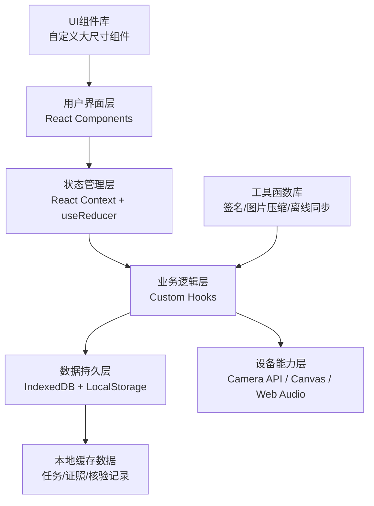
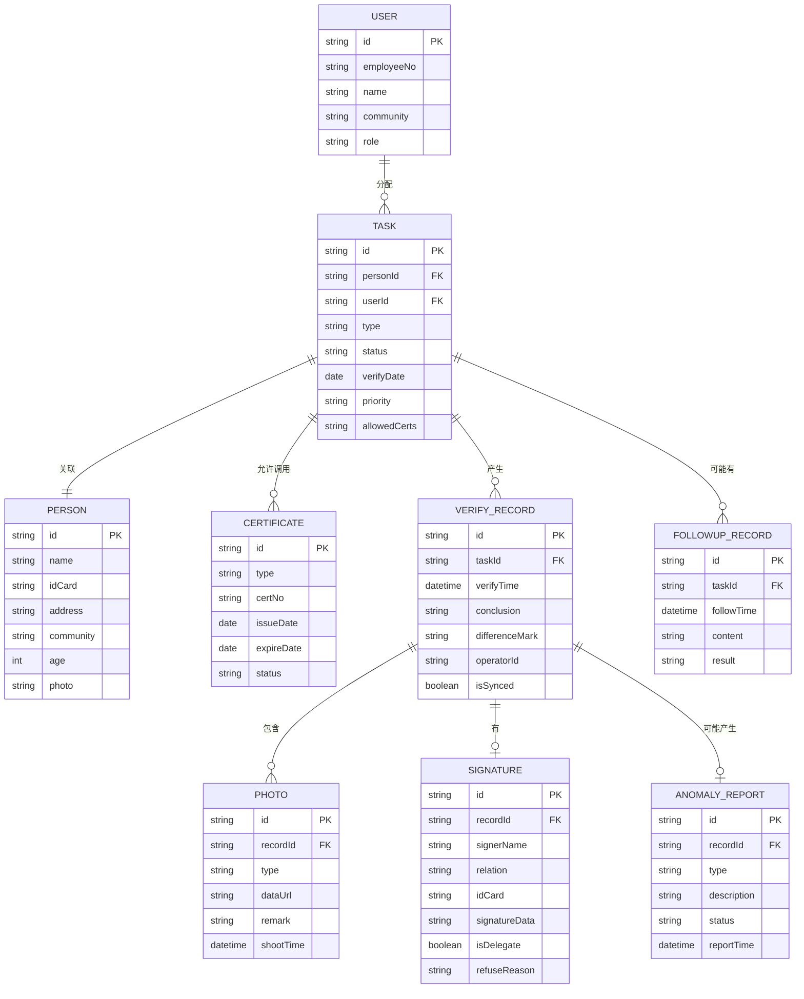

## 1. 架构设计

本应用为纯前端单页应用（SPA），采用React+TypeScript技术栈，通过LocalStorage和IndexedDB实现离线数据缓存，无需后端服务即可独立运行。数据模拟通过Mock数据实现，便于演示和测试。



## 2. 技术描述

### 2.1 技术栈选择
- **前端框架**：React@18 + TypeScript@5 + Vite@5
- **样式方案**：TailwindCSS@3（自定义配置大尺寸、高对比度主题）
- **状态管理**：React Context + useReducer（轻量级，避免过度设计）
- **本地存储**：
  - IndexedDB（通过`idb`库封装）：存储核验记录、照片等大容量数据
  - LocalStorage：存储用户配置、登录状态、网络状态
- **图标库**：Lucide React（粗线条图标，自定义尺寸）
- **手写签名**：react-signature-canvas
- **路由**：React Router@6（Hash路由，适配本地文件部署）
- **构建工具**：Vite@5

### 2.2 关键技术决策
1. **无后端设计**：本产品为演示版本，所有数据采用Mock方式，通过IndexedDB实现本地持久化
2. **离线优先**：所有核心功能在断网时可用，数据先写本地，联网后标记为待同步
3. **平板适配**：使用Tailwind自定义断点，针对10-12寸平板横屏优化
4. **触控优化**：所有交互组件使用`touch-action: manipulation`，禁用双击缩放
5. **大字体主题**：Tailwind自定义fontSize，最小字号text-lg(18px)

## 3. 路由定义

| 路由路径 | 页面名称 | 说明 |
|----------|----------|------|
| `/` | 登录页 | 工号登录、人脸识别入口（模拟） |
| `/tasks` | 任务列表 | 今日任务、完成统计、离线管理 |
| `/verify/:taskId` | 入户核验 | 证照联查、信息比对、拍照佐证 |
| `/authorize/:taskId` | 授权签认 | 电子签名、代签授权、拒绝登记 |
| `/anomaly` | 异常上报 | 线索填报、证据上传、线索跟踪 |
| `/followup` | 回访记录 | 回访任务、历史记录查询 |

## 4. 数据模型

### 4.1 实体关系图



### 4.2 核心TypeScript类型定义

```typescript
// 用户
interface User {
  id: string;
  employeeNo: string;
  name: string;
  community: string;
  role: 'worker' | 'admin';
}

// 任务状态
type TaskStatus = 'pending' | 'in_progress' | 'completed' | 'followup';
type TaskPriority = 'high' | 'normal' | 'low';
type TaskType = 'allowance' | 'subsidy' | 'elderly' | 'disability';

// 任务
interface Task {
  id: string;
  personId: string;
  userId: string;
  type: TaskType;
  status: TaskStatus;
  verifyDate: string;
  priority: TaskPriority;
  allowedCerts: string[];
  person: Person;
}

// 人员信息
interface Person {
  id: string;
  name: string;
  idCard: string;
  address: string;
  community: string;
  age: number;
  photo?: string;
  phone?: string;
}

// 证照
type CertType = 'id_card' | 'elderly_card' | 'disability_card' | 'low_income' | 'medical';

interface Certificate {
  id: string;
  personId: string;
  type: CertType;
  certNo: string;
  issueDate: string;
  expireDate: string;
  status: 'valid' | 'expired' | 'invalid';
  info: Record<string, string>;
}

// 核验记录
type VerifyConclusion = 'pass' | 'review' | 'reject';

interface VerifyRecord {
  id: string;
  taskId: string;
  verifyTime: string;
  conclusion: VerifyConclusion;
  differenceMark: string;
  operatorId: string;
  isSynced: boolean;
  photos: Photo[];
  signature?: Signature;
  anomalyReport?: AnomalyReport;
}

// 照片
type PhotoType = 'door_plate' | 'portrait' | 'environment' | 'cert_photo';

interface Photo {
  id: string;
  recordId: string;
  type: PhotoType;
  dataUrl: string;
  remark: string;
  shootTime: string;
}

// 签名
interface Signature {
  id: string;
  recordId: string;
  signerName: string;
  relation: string;
  idCard: string;
  signatureData: string;
  isDelegate: boolean;
  refuseReason?: string;
}

// 异常上报
type AnomalyType = 'suspicious_fraud' | 'info_mismatch' | 'refuse_cooperate' | 'other';
type AnomalyStatus = 'pending' | 'processing' | 'resolved' | 'rejected';

interface AnomalyReport {
  id: string;
  recordId: string;
  type: AnomalyType;
  description: string;
  status: AnomalyStatus;
  reportTime: string;
  feedback?: string;
}

// 回访记录
interface FollowupRecord {
  id: string;
  taskId: string;
  followTime: string;
  content: string;
  result: string;
  operatorId: string;
}

// 统计数据
interface Statistics {
  totalTasks: number;
  completedTasks: number;
  pendingTasks: number;
  completionRate: number;
  anomalyCount: number;
  byCommunity: Record<string, { total: number; completed: number }>;
}
```

### 4.3 IndexedDB存储结构

| 存储对象 | 主键 | 索引 | 说明 |
|----------|------|------|------|
| tasks | id | userId, status, verifyDate | 任务列表 |
| persons | id | name, idCard, community | 人员信息 |
| certificates | id | personId, type | 证照信息 |
| verifyRecords | id | taskId, isSynced | 核验记录 |
| photos | id | recordId, type | 照片数据 |
| signatures | id | recordId | 签名数据 |
| anomalyReports | id | recordId, status | 异常线索 |
| followupRecords | id | taskId | 回访记录 |

## 5. 核心功能实现方案

### 5.1 离线缓存与同步
- 使用IndexedDB存储所有业务数据，LocalStorage存储轻量状态
- 网络状态监听：`navigator.onLine` + `online/offline`事件
- 数据操作先写入本地，标记`isSynced: false`
- 同步按钮点击时，批量上传未同步数据（模拟API调用）

### 5.2 手写签名
- 使用`react-signature-canvas`组件
- Canvas尺寸适配平板，笔触加粗便于老人签名
- 签名数据导出为PNG图片的Base64格式存储

### 5.3 拍照功能
- 调用`navigator.mediaDevices.getUserMedia`访问摄像头
- Canvas捕获视频帧，压缩后存储为Base64
- 照片类型标签：门牌、人像、居住环境、证照照片

### 5.4 Mock数据生成
- 使用`faker.js`生成真实感的测试数据
- 预置15-20条当日任务，覆盖不同核验类型和优先级
- 预置历史核验记录和异常线索供查询演示

## 6. 性能优化策略

1. **图片压缩**：拍照后自动压缩至最大宽度1280px，质量0.8，减少存储空间
2. **懒加载**：任务列表使用虚拟滚动（react-window），避免大量DOM节点
3. **IndexedDB索引**：常用查询字段建立索引，提升查询速度
4. **防抖节流**：搜索、网络状态监听等操作添加防抖
5. **PWA支持**：添加Service Worker缓存静态资源，支持离线启动
